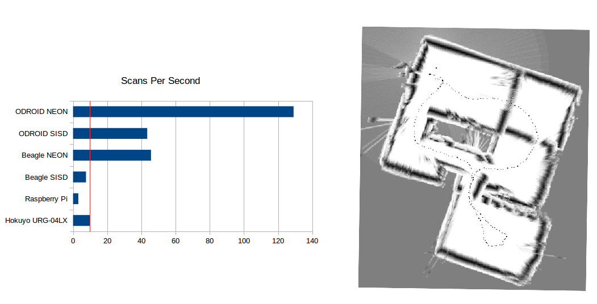

BreezySLAM
==========

    
<a href="https://github.com/simondlevy/BreezySLAM">This repository</a> contains everything you need to
start working with 
<a href="http://en.wikipedia.org/wiki/Lidar">Lidar</a>
-based
<a href="http://en.wikipedia.org/wiki/Simultaneous_localization_and_mapping">SLAM</a> 
in Python. (There is also support for Matlab, C++, and Java; however, because of the popularity of
Python for this kind of work, I am no longer updating the code for those languages.)
BreezySLAM works with Python 3 on Linux and Mac OS X, and
with C++ on Linux and Windows.
By using Python C extensions, we were able to get the Python and Matlab versions to run
as fast as C++. For maximum efficiency on 32-bit platforms, we use Streaming
SIMD extensions (Intel) and NEON (ARMv7) in the compute-intensive part
of the code.

BreezySLAM was inspired by the <a href="http://home.wlu.edu/%7Elambertk/#Software">Breezy</a>
approach to Graphical User Interfaces developed by my colleague 
<a href="http://home.wlu.edu/%7Elambertk/">Ken Lambert</a>: an object-oriented
Application Programming Interface that is simple enough for beginners to use,
but that is efficient enough to scale-up to real world problems; for
example, the mapping of an entire floor of a house, shown in the image above-right,
made by a BreezySLAM 
<a href="https://www.linkedin.com/pulse/slam-your-robot-drone-python-150-lidar-chris-fotache">user</a>.

As shown in the following code fragment, the basic API is extremely 
simple: a constructor that accepts Lidar parameters and the size of 
the map (pixels) and mapping area (meters); a method for updating with the current scan; a method that returns
the current robot position; and a method for retrieving the current map as a byte
array.

<pre>
from breezyslam.algorithms import RMHC_SLAM

lidar = MyLidarModel()

mapbytes = bytearray(800*800)

slam = <b>RMHC_SLAM</b>(lidar, 800, 35) 

while True:

    scan = readLidar()

    slam.update(scan)

    x, y, theta = slam.<b>getpos</b>(scan)

    slam.getmap(mapbytes)
</pre>

If odometry is available, it can also be passed into the update method.  

<h3>Installing for Python</h3>

The BreezySLAM installation uses the popular
<a href="http://docs.python.org/2/distutils/introduction.html">distutils</a> 
approach to installing Python packages, so all you should have to do is
download and unzip the file, cd to <tt><b>BreezySLAM/python</b></tt>, and do 

<pre>
sudo python3 setup.py install
</pre>

For a quick demo, you can then cd to <tt><b>BreezySLAM/examples</b></tt> and do

<pre>
make pytest
</pre>

This will generate and display a PGM file showing the
map and robot trajctory for the Lidar scan and odometry data in the log file
<tt><b>exp2.dat</b></tt>.  If you have the 
<a href="http://www.pythonware.com/products/pil/">Python Imaging Library</a> installed,
you can also try the <b><tt>log2png.py</tt></b> script to generate a
a PNG file instead.

If you have installed [PyRoboViz](https://github.com/simondlevy/PyRoboViz),
you can see a &ldquo;live&rdquo; animation by doing

<pre>
make movie
</pre>

You can turn off odometry by setting the <b><tt>USE_ODOMETRY</tt></b>
parameter at the top of the Makefile to 0 (zero). You can turn off 
the particle-filter (Monte Carlo position estimation) by commenting-out
<b><tt>RANDOM_SEED</tt></b> parameter.

To see what other features are available, do 

<pre>
pydoc3 breezyslam
</pre>

By using the component classes <b>Map</b>, <b>Scan</b>, and
<b>Position</b> and the <b>distanceScanToMap()</b> method,
you can develop new algorithms and particle filters of your own.

<h3>Testing with the Hokuyo URG04LX</h3>

If you're running on Linux, you can install the <a href="http://home.wlu.edu/~levys/software/breezylidar/">BreezyLidar</a> package, the OpenCV Python package, and 
try the  <b>urgslam.py</b> example in the examples folder.

<h3>Testing with the GetSurreal XV Lidar</h3>

BreezySLAM includes Python support for the inexpensive 
<a href="https://www.getsurreal.com/product/xv-lidar-sensor-mount-package">XV Lidar</a> from GetSurreal.
To try it out, you'll also need the <a href="https://github.com/simondlevy/xvlidar">xvlidar</a> 
Python package.  Once you've installed
both packages, you can run the <b>xvslam.py</b> example in the <b>BreezySLAM/examples</b> folder.

<h3>Testing with the SLAMTEC RPLidar A1</h3>

BreezySLAM also includes Python support for the inexpensive 
<a href="http://www.slamtec.com/en/lidar/a1">RPLidar A1</a> from SLAMTECH.
To try it out, you'll also need the <a href="https://github.com/SkoltechRobotics/rplidar">rplidar</a> 
Python package.  Once you've installed that package, you can run the
<b>rpslam.py</b> example in the <b>BreezySLAM/examples</b> folder.

<h3>Installing for Matlab</h3>

I have run BreezySLAM in Matlab on 64-bit Windows, Linux, and Mac OS X. The <b>matlab</b> directory contains all the code you
need, including pre-compiled binaries for all three operating systems.  To try it out in Matlab, add this directory to your
path, then change to the <b>examples</b> directory and do

<pre>
  >> logdemo('exp2', 1)
</pre> 

If you modify the source code or want to build the binary for a different OS, you can change to the <b>matlab</b> 
directory and do

<pre>
  >> make
</pre>

For making the binary on Windows I found 
<a href="http://www.mathworks.com/matlabcentral/answers/95039-why-does-the-sdk-7-1-installation-fail-with-an-installation-failed-message-on-my-windows-system">these instructions</a> very helpful when I ran into trouble.

<h3>Installing for C++</h3>

Just cd to <tt><b>BreezySLAM/cpp</b></tt>, and do

<pre>
sudo make install
</pre>

This will put the <tt><b>libbreezyslam</b></tt> shareable library in your <tt><b>/usr/local/lib</b></tt>
directory.  If you keep your shared libraries elsewhere, just change the <tt><b>LIBDIR</b></tt>
variable at the top of the Makefile.  You may also need to add the following line to your <b>~/.bashrc</b>
file:

<pre>
export LD_LIBRARY_PATH=$LD_LIBRARY_PATH:/usr/local/lib
</pre>

For a quick demo, you can then cd to <tt><b>BreezySLAM/examples</b></tt> and do

<pre>
make cpptest
</pre>

Again, you'll need to change the <tt><b>LIBDIR</b></tt> variable at the top of 
the Makefile in this directory as well, if you don't use <tt><b>/usr/local/lib</b></tt>.

<h3>Installing for Java</h3>

In <tt><b>BreezySLAM/java/edu/wlu/cs/levy/breezyslam/algorithms</b></tt> and
<tt><b>BreezySLAM/java/edu/wlu/cs/levy/breezyslam/components</b></tt>,
edit the <tt>JDKINC</tt> variable in the Makefile to reflect where you installed the JDK.
Then run <b>make</b> in these directories.

For a quick demo, you can then cd to <tt><b>BreezySLAM/examples</b></tt> and do

<pre>
make javatest
</pre>

<h3>Notes on Windows installation</h3>

Because of the 
<a href="http://stackoverflow.com/questions/2817869/error-unable-to-find-vcvarsall-bat">difficulties</a> that I and others have had installing Python extensions on Windows, I am no longer supporting 
the Python version of this package on Windows. If you want to try it yourself, <a href="https://docs.python.org/2/extending/windows.html">here</a> are some instructions.

To build and use the C++ library on Windows, I used MinGW. Whatever C++ compiler
you use, you'll have to add the location of the <tt><b>.dll</b></tt> file to your
<tt><b>PATH</b></tt> environment variable in the Advanced Systems Settings.

<h3>Adding new particle filters</h3>

Because it is built on top of the CoreSLAM (<a href="https://openslam.org/tinyslam.html">tinySLAM</a>) code base, BreezySLAM
provides a clean separation between
the map-building and particle-filtering (Monte Carlo position estimation)
components of SLAM.  To add a new particle filter, you can subclass 
<a href="doc/breezyslam.algorithms.html#CoreSLAM">breezyslam.algorithms.CoreSLAM</a> or 
<a href="doc/breezyslam.algorithms.html#SinglePositionSLAM">breezyslam.algorithms.SinglePositionSLAM</a>
classes, implementing the relevant methods.

<h3>Copyright, licensing, and questions</h3>

Copyright and licensing information (Gnu 
<a href="https://www.gnu.org/licenses/lgpl.html">LGPL</a>) 
can be found in the header of each source file. 

<h3>Personnel</h3>

Suraj Bajracharya, Simon D. Levy, Matt Lubas, Alfredo Rwagaju

<h3>Acknowledgments</h3>

This work was supported in part by a  Commonwealth Research Commercialization Fund
grant from the Center for Innovative Technology (CRCF #MF14F-011-MS). We thank Michael Searing of Olin College for 
his help in debugging and testing this package.
